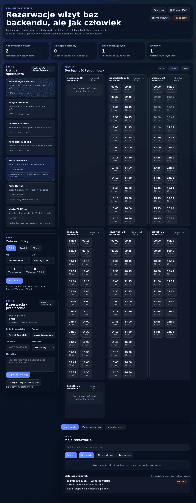
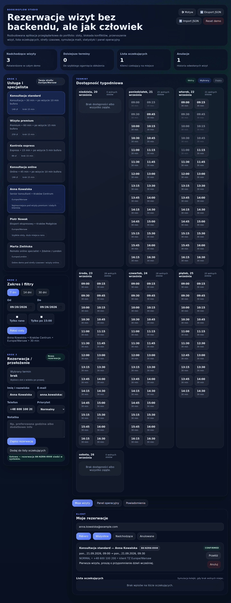
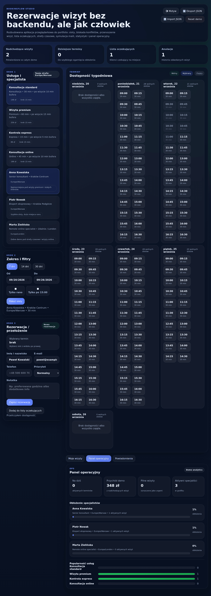
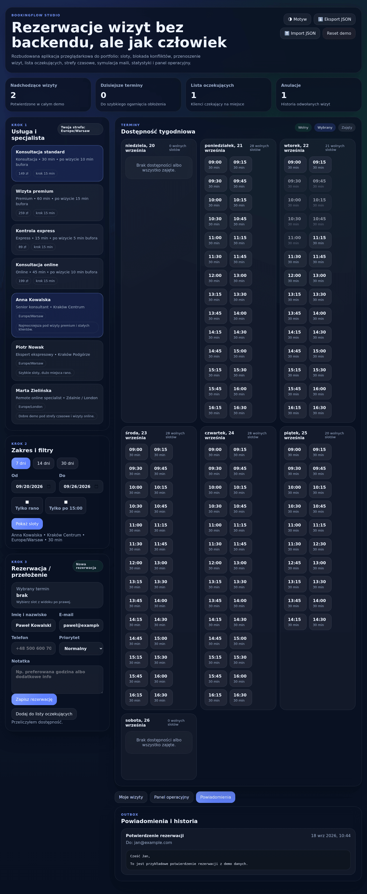
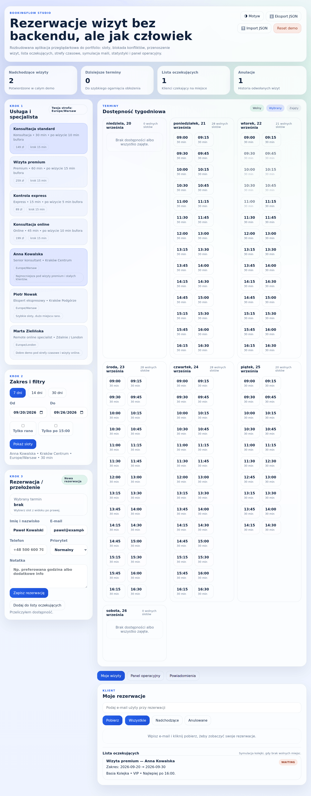

# BookingFlow Studio

Przeglądarkowe demo systemu rezerwacji wizyt — **bez backendu**, całość trzyma się
w `localStorage`. Projekt portfolio pokazujący pracę ze stref­ami czasowymi,
generowaniem slotów, blokadą konfliktów i prostą warstwą „operacyjną".

## Funkcje

- **Generowanie slotów** na podstawie godzin pracy specjalisty, przerw, kroku
  czasowego usługi i bufora po wizycie.
- **Strefy czasowe** liczone przez `Intl.DateTimeFormat` (specjaliści w `Europe/Warsaw`
  i `Europe/London`, klient widzi własną strefę).
- **Blokada konfliktów** — zajęte terminy są pokazywane jako wyszarzone i nieklikalne.
- **Rezerwacja, przełożenie i anulowanie** wizyt z symulacją maili (outbox).
- **Lista oczekujących** z auto-promocją na pierwszy zwolniony slot.
- **Panel operacyjny** — obłożenie specjalistów, popularność usług, przychód demo.
- **Eksport / import JSON**, reset danych, motyw jasny/ciemny, sync między kartami
  przez `BroadcastChannel`.

## Zrzuty ekranu

Zrzuty są robione automatycznie przeglądarką sterowaną skryptem, na aplikacji
serwowanej po HTTP — to stan z tego commita, nie makieta. Rezerwacja na
zrzucie `rezerwacja.png` została faktycznie założona przez interfejs.

### Tygodniowa dostępność


### Rezerwacja założona przez interfejs


### Panel operacyjny


### Powiadomienia (symulowany outbox)


### Motyw jasny


### Widok mobilny


## Uruchomienie

Aplikacja używa modułów ES (`<script type="module">`), więc trzeba ją serwować
po HTTP (otwarcie `index.html` przez `file://` zablokuje import modułów).

```bash
# dowolny statyczny serwer, np.:
npx serve .
# albo
python3 -m http.server 8000
```

Następnie otwórz `http://localhost:8000`.

## Testy i CI

Czysta logika (daty, strefy czasowe, silnik dostępności) jest wydzielona do
modułów bez zależności od DOM i pokryta testami jednostkowymi (Vitest).

```bash
npm install
npm test          # 23 testy
npm audit         # 0 podatności
```

`.github/workflows/ci.yml` uruchamia na każdej gałęzi dwa zadania:

| Zadanie | Co robi |
|---|---|
| Testy jednostkowe | `npm ci` → 23 testy → `npm audit --audit-level=high` |
| Składnia modułów | `node --check` na `app.js`, `availability.js`, `dateUtils.js` |

Drugie zadanie istnieje dlatego, że **`app.js` nie ma testów jednostkowych** —
dotyka DOM-u, więc nie da się go uruchomić w Node bez przeglądarki. Ten krok
niczego nie udaje: sprawdza tylko to, co da się sprawdzić bez przeglądarki,
czyli czy pliki są poprawnym JavaScriptem. Literówka składniowa w `app.js`
zepsułaby całą aplikację, a bez tego kroku wyszłaby dopiero po otwarciu
strony.

### Czego świadomie nie zrobiono

`app.js` ma ~1200 linii i dałoby się go rozbić na stan / render / obsługę
zdarzeń. Nie zostało to zrobione, bo nie ma testów na poziomie DOM-u, które
złapałyby regresję — a rozbijanie pliku bez takiej siatki jest dokładnie tą
zmianą, która wygląda porządnie i po cichu coś psuje. Kolejność jest
odwrotna: najpierw testy przeglądarkowe, potem podział.

Zachowanie krytyczne (blokada konfliktów) zostało natomiast sprawdzone ręcznie
na działającej aplikacji: rezerwacja slotu 09:00 przy usłudze 30 min z 10 min
bufora zablokowała sloty 09:00, 09:15 i 09:30 — dokładnie tak, jak powinna.


## Struktura

| Plik             | Odpowiedzialność                                              |
| ---------------- | ------------------------------------------------------------ |
| `index.html`     | Szkielet UI + szablony `<template>`                          |
| `styles.css`     | Style, motywy, responsywność, focus/`prefers-reduced-motion` |
| `dateUtils.js`   | Czyste helpery dat i stref czasowych (testowalne)           |
| `availability.js`| Czysty silnik dostępności slotów (testowalny)               |
| `app.js`         | Stan, render i obsługa zdarzeń (warstwa DOM)                |
| `tests/`         | Testy jednostkowe Vitest                                     |

## Decyzje projektowe

- **Brak backendu** — celem jest demo logiki front-endu; dane żyją w `localStorage`,
  a maile lądują w symulowanym outboxie.
- **Czysta logika oddzielona od DOM** — `dateUtils.js` i `availability.js` nie dotykają
  `window`/`document`, dzięki czemu silnik slotów można testować w Node.
- **Renderowanie przez `textContent`/`<template>`** zamiast wstrzykiwania HTML, żeby
  zaimportowany JSON nie mógł wprowadzić treści wykonywalnej (brak powierzchni XSS).

## Wdrożenie

`.github/workflows/pages.yml` publikuje aplikację na GitHub Pages po każdym
pushu do `main`. Nie ma kroku budowania — publikowane są wprost pliki, które
pobiera przeglądarka (`index.html`, `styles.css` i trzy moduły). Reszta
repozytorium (`package.json`, testy, konfiguracja) zostaje na miejscu: dla
odwiedzającego nie ma z niej pożytku.

> **Wymaga jednorazowego kroku ręcznego:** w Settings → Pages źródło trzeba
> przestawić na **GitHub Actions**. Tego nie da się zrobić z poziomu kodu.

## Licencja

MIT — patrz [LICENSE](LICENSE).
